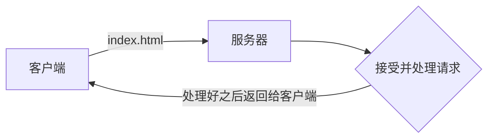
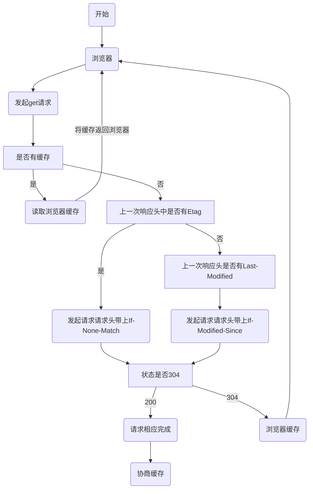

## 什么是web缓存？

`web缓存`主要指的是两部分：`浏览器缓存`和`http缓存`。

http缓存是web缓存的核心，是最难懂的那一部分,也是最重要的那一部分。

浏览器缓存：例如 `localStorage(5M)`、`sessionStorage(5M)`、`cookie(4k)`等等。这些功能主要用于缓存一些必要的数据，比如用户信息。比如需要携带到后端的参数。亦或者是一些列表数据等等。

## 缓存可以解决什么问题？

1. 减少不必要的网络传输，节约宽带（就是`省钱`）
2. 更快的加载页面（就是`加速`）
3. 减少服务器负载，避免服务器过载的情况出现。（就是`减载`）

## 缺点是什么？

1. 占内存（有些缓存会被存到内存中）

<!-- more -->

## http缓存

::: info 官方介绍
`Web缓存`是可以`自动保存`常见文档副本的 `HTTP设备`。当`Web请求`抵达缓存时，如果本地有`已缓存的`副本，就可以从`本地存储设备`而不是`原始服务器`中提取这个文档。
:::



服务器需要处理`http`的请求，而缓存，就是为了让服务器`不去处理`这个请求，客户端也可以`拿到数据`。

注意，缓存主要是针对`html`、`css`、`img`等`静态资源`，常规情况下，**不会去缓存一些动态资源**。

### 大纲

**我们把`http缓存`问题拆分下，可以从以下几个方面来回答这个问题:**
- 缓存的类型 (`强缓存`or`协商缓存`)
- 缓存位置 (`Service Worker`、`Memory Cache`...)
- 缓存过程分析
- 缓存策略的实际场景应用

### 缓存的类型

首先从缓存的类型上来说，可以分为两种: **强缓存** 与 **协商缓存**

强缓存是**不需要发送HTTP请求的，而协商缓存需要**

也就是在**发送HTTP请求之前**，浏览器会**先检查**一下`强缓存`，如果命中直接使用，否则就进入下一步。



#### 强缓存

浏览器检查强缓存的方式主要是判断这两个字段:

- `HTTP/1.0`使用的是`Expires`;
- `HTTP/1.1`使用的是`Cache-Control`;

##### Expires

Expires字面意思是`有效期`，那么很好理解，它表示的就是一个具体的时间

例如:
```http request
Expires: Wed,Nov 11 2020 08:00:00 GMT
```
表示这个资源在**2020年11月11日8点**之前，都会去**本地的磁盘（或内存）中读取**，不会去服务器请求。过了这个时间就得**向服务端发请求**了。

::: info 很有意思的是

`Expires`过度**依赖本地时间**，如果 **本地与服务器时间不同步**，就会出现资源 **无法被缓存** 或者 **资源永远被缓存** 的情况。

若是设置了`Expires`，但是 **服务器的时间** 与 **浏览器的时间** **不一致** 的时候(比如你手动修改了本地的时间)，

那么就可能会造成**缓存失效**，因此这种方式强缓存方式并不是很准确，它也因此在`HTTP/1.1`中被**摒弃**了。
:::
##### Cache-Control
摒弃了Expires之后，HTTP/1.1 采用了Cache-Control这个重要的规则。  
它设置的是一个具体的过期时长，其中的一个属性是max-age。

例如🌰:
```http request
Cache-Control: max-age=300
```

表示的是这个资源在响应之后的300s内过期，也就是5分钟之内再次获取这个资源会直接使用缓存。

Cache-Control不仅仅有max-age 这一个属性，其实它有很多的用法，你甚至可以采用组合的方式:

```http request
Cache-Control: public,max-age=300
```

上面用法的意思是响应可以被任何对象(客户端，代理服务器等)缓存，且过期时长为5分钟。
(因为一个请求经历的不仅仅是客户端(浏览器)和目标服务器，它中间有可能会经过不同的代理服务器)

下面来例举一些常用的指令:
- public: 客户端和代理服务器都可以缓存。
 > 响应可以被中间任何的一个节点缓存，比如一个请求要经历 Browser -> proxy1 -> proxy2 -> Server，中间的代理(proxy)可以缓存资源。 下次再请求同一资源的时候，浏览器就会直接到proxy1中拿缓存的东西而不必向proxy2拿。
- private: 这个是Cache-Control默认的取值，只有客户端可以缓存，中间节点不允许缓存。
 > 在 Browser -> proxy1 -> proxy2 -> Server 这个过程中，代理(proxy)不会缓存任何数据，当Browser再次请求时，proxy会把Server返回的数据发送给Brower，做好请求转发，而不是给自己缓存的数据。
- no-cache: 表示不进行强缓存验证，而是用协商缓存来验证。
- no-store: 所有内容都不会被缓存，不进行强缓存，也不进行协商缓存。
- max-age: 表示在多久之后过期，比如max-age=300表示在300s后缓存内容失效。
- s-max-age: 它的作用和max-age很像， 不过max-age 用于普通缓存，而s-max-age用于代理缓存，且s-max-age的优先级更高。
- max-stale: 能容忍的最大过期时间。
 > max-stale指令表示客户端愿意接收一个已经过期了的响应。
- min-fresh：能够容忍的最小新鲜度。
 > min-fresh表示客户端不愿意接受新鲜度不多于当前的age加上min-fresh设定的时间之和的响应。

基于上面的这些指令，我们可以将它们进行组合，达到多个目的， 不同的效果。
有一张来自[《浪里行舟-深入理解浏览器的缓存机制》](https://www.jianshu.com/p/54cc04190252)中的图表述的非常好:


#### Expires和Cache-control的对比
- Expires产于HTTP/1.0，Cache-control产于HTTP/1.1;
- Expires设置的是一个具体的时间，Cache-control 可以设置具体时长还有其它的属性;
- 两者同时存在，Cache-control的优先级更高;
- 在不支持HTTP/1.1的环境下，Expires就会发挥作用，所以现阶段的存在是为了做一些兼容的处理。

### 协商缓存

在上面我们已经介绍了强缓存，它是不需要发送HTTP请求的，若是强缓存失效，则会进入协商缓存。

协商缓存概括来说 就是浏览器会携带缓存标识(tag)向服务器发送请求，服务器会根据缓存标识(tag)来决定是否使用缓存。

所以对于服务器的返回结果会有这两种情况:

- 协商缓存生效，返回304和Not Modified(空的响应体)
- 协商缓存失效，返回200和请求结果

而刚刚提到的这个缓存标识(tag)也是有两种。

分为Last-Modified和 ETag。

#### Last-Modified 和 If-Modified-Since

从字面意思上我们可以看出，Last-Modified表示的是资源的最后修改时间，因此其中一种协商缓存判断的就是最后修改时间。

那它具体是怎样实现的呢?

其实使用Last-Modified进行协商缓存会经过以下几步:

1. 浏览器第一次向服务器请求这个资源
2. 服务器在返回这个资源的时候，在response header中添加Last-Modified的header，值为该资源在服务器上最后的修改时间
3. 浏览器接收到后缓存文件和这个header
4. 当下次浏览器再次请求这个资源的时候， 检测到有Last-Modified这个header，就会在请求头中添加If-Modified-Since这个header，该值就是Last-Modified
5. 服务器再次接收到该资源的请求，则根据If-Modified-Since与服务器中的这个资源的最后修改时间做对比
6. 对比结果相同则返回304和一个空的响应体，告诉浏览器从自己(浏览器)的缓存中拿
7. 对比结果不同(If-Modified-Since < 服务器资源最后修改时间)，则表示资源被修改了，则返回200和最新的资源文件(当然还包括最新的Last-Modefied)


#### ETag 与 If-None-Match

1. ETag其实与Last-Modefied的原理差不多，不过它不是根据资源的最后修改时间来判断的，而是通过一个唯一的标识。 
2. 在浏览器请求服务器资源的时候，服务器会根据当前文件的内容，给文件生成一个唯一的标识，若是文件发生了改变，则这个标识就会改变。 
3. 服务器会将这个标识ETag放到响应体的header中与请求的资源一起返回给浏览器，而浏览器同样也会缓存文件与这个header。 
4. 在下一次再次加载该资源时，浏览器会将刚刚缓存的ETag放到请求体头部(request header)的If-None-Match里发送给服务器。 
5. 同样的服务器接收到了之后与该资源自身的ETag做对比，如果一致，则表示该资源未发生改变，则直接返回304知会客户端直接使用本地缓存即可。 
6. 若是不一致，则返回200和最新的资源文件(当然还包括最新的ETag)

如下图:


#### 两者对比

在进行对比之前，我们先来看看两者都有什么优缺点呢?

首先对于Last-Modified:

- 若是本地打开了缓存文件，并没有进行修改，也还是会改变最后修改时间，导致缓存失败;
- 由于Last-Modified是以秒来计时的，若是某个文件在一秒内被修改了很多次，那么这时候的 Last-Modified 并没有体现出修改了。

然后对于ETag:

- 性能上的不足，只要文件发生改变，ETag就会发生改变。 ETag需要服务器通过算法来计算出一个hash值。

**总结，所以对于两种协商缓存:**

- 准确度上ETag更强;
- 性能上Last-Modified更好;
- 两者都支持的话，ETag优先级更高。

## 缓存位置

在上面我们已经介绍完了缓存的类型，但是之前也提到过了，若是命中了强缓存或者服务器返回了304之后，
要浏览器从缓存中过去资源，那这些缓存具体是存储在哪里呢?

从优先级上来说分为以下四种:

- Service Worker
- Memory Cache
- Disk Cache
- Push Cache

### Service Worker
Service Worker是运行在浏览器背后的独立线程，也就是说它脱离了浏览器的窗体，无法直接访问DOM。
功能上主要是能实现: 离线缓存、消息推送、网络代理等。比如离线缓存就是Service Worker Cache。

简单来说，它有以下几个特点:

- 借鉴了Web Worker的思路
- 使用Service Worker会涉及到请求拦截，所以需要用HTTPS协议来保证安全，传输协议必须是HTTPS
- 与浏览器其它内建的缓存机制不同，它可以让我们自由的控制缓存哪些文件、如何匹配读取缓存，且缓存是持续性的
- Service Worker同时也是PWA的重要实现机制

### Memory Cache
从命名上来说，Memory Cache就是内存中的缓存，存储的主要是当前页面已经抓取到的资源，
比如页面上已经下载的样式、脚本、图片等。

Memory Cache的特点:

- 读取效率快，可是缓存持续时间短，会随着进程的释放而释放(一旦关闭Tab页面，就被释放了，还有可能在没关闭之前，排在前面的缓存就失效了，例如一个页面的缓存占用了超级多的内存)
- 几乎所有的请求资源都能进入memory Cache，细分来说主要分为preloader和preload这两块。
- 在从memory Cache读取缓存时，浏览器会忽视Cache-Control中的一些max-age、no-cache等头部配置，除非设置了no-store这个头部配置。

**preloader**

上面提到的preloader是页面优化的常见手段之一，它的作用主要是用于在浏览器打开一个网页的时候,能够一边解析执行js/css，一边去请求下一个资源，而这些被 preloader 请求来的资源就会被放入 memory Cache 中，供之后的解析执行操作使用。

**preload**

preload与preloader仅两个字母之差，它能显式指定预加载的资源，这些资源也会被放进memory Cache中，例如<link rel="preload">

### Disk Cache

Disk Cache，也叫做HTTP Cache，是存储在硬盘上的缓存，所以它是持久存储，是实际存在于文件系统中的。

从存储效率上说，它比内存缓存慢，但是优势在于存储容量更大，且存储时长更长。

在所有浏览器缓存中，Disk Cache是覆盖面最大的。 它会根据前面我们提到的HTTP header中的缓存字段来判断哪些资源需要缓存，哪些资源不需要请求而直接使用，哪些已经过期了需要重新请求获取。

若是命中了缓存之后，浏览器会从硬盘中直接读取资源，虽然没有从内存中读取的快，但是却是比网络缓存快。

前面提到的强缓存和协商缓存也是属于Disk Cache，它们最终都存储在硬盘里。

**Memory Cache与Disk Cache两者的对比:**

- 比较大的JS、CSS文件会被丢硬盘中存储，反之则存储在内存中
- 当前系统内存使用率比较高的时候，文件优先进入磁盘

### Push Cache

Push Cache(推送缓存)，它是浏览器缓存的最后一段防线，当以上三种缓存都没有命中的时候，它才会被使用。

我所知道的，它只会在会话(Session)中存在，一旦会话结束它就会被释放，并且缓存时间也很短暂，在Chrome浏览器中只有5分钟。

另外由于它是 HTTP/2 中的内容，因此在国内不是很普及，这里贴上一个比较好的总结:

- 所有的资源都能被推送，并且能够被缓存,但是 Edge 和 Safari 浏览器支持相对比较差
- 可以推送 no-cache 和 no-store 的资源
- 一旦连接被关闭，Push Cache 就被释放
- 多个页面可以使用同一个HTTP/2的连接，也就可以使用同一个Push Cache。这主要还是依赖浏览器的实现而定，出于对性能的考虑，有的浏览器会对相同域名但不同的tab标签使用同一个HTTP连接。
- Push Cache 中的缓存只能被使用一次
- 浏览器可以拒绝接受已经存在的资源推送
- 你可以给其他域名推送资源

## 缓存过程分析

上面已经向大家介绍了缓存类型已经缓存的位置，那么浏览器具体的一个缓存行径是怎样的呢?

从浏览器发起HTTP请求到获得请求结果，可以分为以下几个过程:

1. 浏览器第一次发起HTTP请求，在浏览器缓存中没有发现请求的缓存结果和缓存标识
2. 因此向服务器发起HTTP请求，获得该请求的结果还有缓存规则(也就是Last-Modified 或者ETag)
3. 浏览器把响应内容存入Disk Cache，把响应内容的引用存入Memory Cache
4. 把响应内容存入 Service Worker 的 Cache Storage (如果 Service Worker 的脚本调用了 cache.put())

下一次请求相同资源的时候:

1. 调用Service Worker 的fetch事件响应
2. 查看memory Cache
3. 查看disk Cache。 这里细分为:

> 有强缓存且未失效，则使用强缓存，不请求服务器，返回的状态码都是200
> 有强缓存且已失效，使用协商缓存判断，是返回304还是200(读取缓存还是重新获取)

## 缓存策略的实际场景应用

说了这么多缓存策略，那么在实际使用上来说，我们一般是怎样使用它的呢?

**不常变化的资源**

对于不常变化的资源:
```http request
Cache-Control: max-age=31536000
```

通常是给Cache-Control设置成一个很大的值，(31536000，一年)。 这个也很好理解，不常变化的资源，直接让它使用缓存就是了。

但是有时候为了解决更新的问题，我们需要在文件名中添加上hash，版本号等动态字段，这样就达到了更改引用URL 的目的。

**常变化的资源**

经常变化的资源，我们进行以下配置:
```http request
Cache-Control: no-cache
```

设置成以上配置，使得浏览器每次都请求服务器，然后配合ETag或者Last-Modified来验证资源是否有效。

## 后语

浏览器缓存的内容其实还有很多可以说的，这里主要是总结了一些面试时常问到的，你可以转化成自己的言语来回答面试官。
